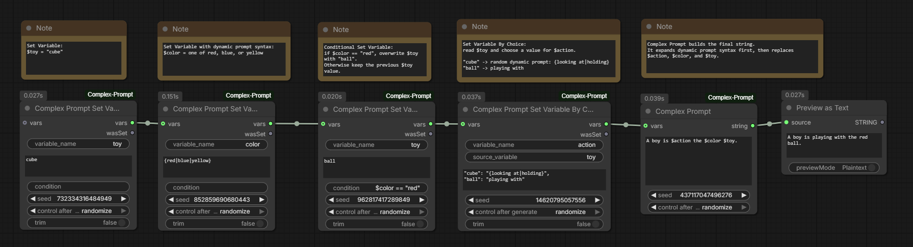
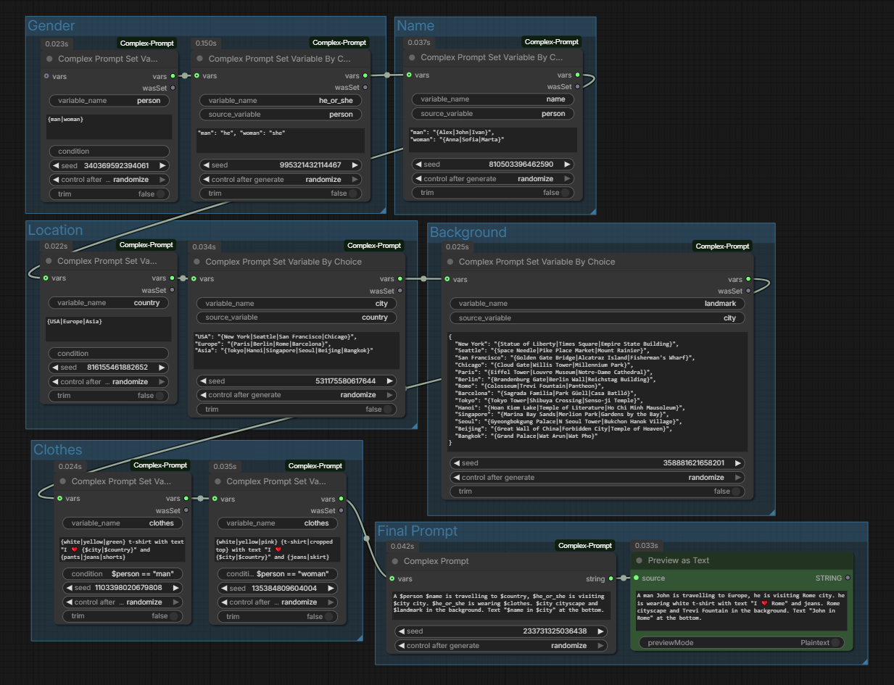
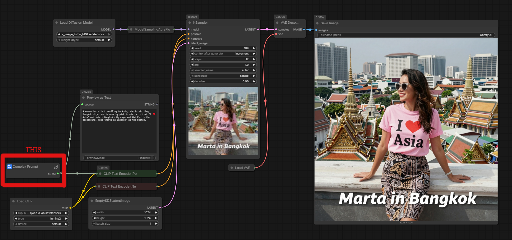

# ComfyUI-Complex-Prompt

ComfyUI custom nodes for building complex text prompts with dynamic variants, workflow variables, JSON-imported variables, and basic conditional logic.

Simple workflow with explanatory notes:



## Nodes

Complex Prompt:

- Name: `Complex Prompt`
- Class: `ArtemKo7vComplexPrompt`
- Description: expands a prompt with `dynamicprompts`, then replaces `$variable_name` tokens from `ComplexPromptVars`
- Category: `ArtemKo7v`
- Output string: `STRING`

Complex Prompt Set Variable:

- Name: `Complex Prompt Set Variable`
- Class: `ArtemKo7vComplexPromptSetVariable`
- Description: creates or updates a `ComplexPromptVars` object with an optional condition
- Category: `ArtemKo7v`
- Output vars: `ArtemKo7vComplexPromptVars`
- Output wasSet: `BOOLEAN`

Complex Prompt Set Variable By Choice:

- Name: `Complex Prompt Set Variable By Choice`
- Class: `ArtemKo7vComplexPromptSetVariableByChoice`
- Description: creates or updates one variable by matching another variable against a JSON choice map
- Category: `ArtemKo7v`
- Output vars: `ArtemKo7vComplexPromptVars`
- Output wasSet: `BOOLEAN`

Complex Prompt Parse JSON:

- Name: `Complex Prompt Parse JSON`
- Class: `ArtemKo7vComplexPromptParseJSON`
- Description: creates or extends `ComplexPromptVars` from a JSON object
- Category: `ArtemKo7v`
- Output vars: `ArtemKo7vComplexPromptVars`

Complex Prompt Empty String:

- Name: `Complex Prompt Empty String`
- Class: `ArtemKo7vComplexPromptEmptyString`
- Description: returns an empty string for workflow branches that need an explicit blank text input
- Category: `ArtemKo7v`
- Output string: `STRING`

## Features

- Expands dynamic prompt syntax through `dynamicprompts`, including variants such as `{red|green|blue}`
- Preserves `$variable_name` tokens while `dynamicprompts` parses the prompt
- Replaces variables after dynamic prompt expansion
- Passes `ComplexPromptVars` between nodes
- Creates variables from multiline text
- Creates dependent variables by matching another variable's value
- Optionally trims variable values before storing them
- Supports conditional variable assignment with `&&`, `||`, `!`, comparisons, and `int`, `float`, `str`
- Imports variables from JSON strings
- Selects one random item from JSON arrays of strings or numbers
- Supports deterministic randomness through `seed`, with ComfyUI randomizing seeds after generation
- Leaves unknown `$variable_name` tokens unchanged in final prompts
- Avoids calling `dynamicprompts` for plain text that has no dynamic prompt syntax

## Installation

Place this folder into your ComfyUI `custom_nodes` directory.

Install dependencies in the same Python environment used by ComfyUI:

```bash
pip install -r requirements.txt
```

Dependencies:

- `dynamicprompts>=0.31.0`
- `simpleeval>=1.0.7`

Restart ComfyUI after installing or updating the node.

## Prompt Syntax

Dynamic prompt variants use `dynamicprompts` syntax:

```text
a {red|green|blue} car
```

This outputs one selected variant, such as:

```text
a green car
```

Variables use `$variable_name`:

```text
$person in a {red|green|blue} car
```

If `person` exists in `vars`, `$person` is replaced with its value after dynamic prompt expansion. If it does not exist, `$person` remains unchanged.

Variable tokens match this pattern:

```text
$[A-Za-z_][A-Za-z0-9_]*
```

## Inputs

`Complex Prompt`:

- `prompt`: multiline text prompt
- `seed`: seed passed to `dynamicprompts`
- `vars`: optional `ComplexPromptVars`

`Complex Prompt Set Variable`:

- `variable_name`: key to store in `vars`
- `value`: multiline text; dynamic prompt syntax is expanded before storage
- `condition`: optional expression; empty condition always stores the variable
- `seed`: seed passed to `dynamicprompts`
- `trim`: removes whitespace, newlines, and tabs from the beginning and end of the final value before storage
- `vars`: optional existing `ComplexPromptVars`

`Complex Prompt Set Variable By Choice`:

- `variable_name`: key to store in `vars`
- `source_variable`: existing variable name to read; both `gender` and `$gender` are accepted
- `choices`: JSON object mapping source values to prompt values
- `seed`: seed passed to `dynamicprompts`
- `trim`: removes whitespace, newlines, and tabs from the beginning and end of the final value before storage
- `vars`: existing `ComplexPromptVars`

`Complex Prompt Parse JSON`:

- `json_text`: JSON object whose keys become variable names
- `seed`: seed used when choosing random values from arrays
- `vars`: optional existing `ComplexPromptVars`

`Complex Prompt Empty String`:

- No inputs

## Outputs

`Complex Prompt`:

- `string`: final prompt text after dynamic expansion and variable replacement

`Complex Prompt Set Variable`:

- `vars`: new or updated `ComplexPromptVars`
- `wasSet`: `true` when the variable was stored, `false` when the condition prevented the update

`Complex Prompt Set Variable By Choice`:

- `vars`: new or updated `ComplexPromptVars`
- `wasSet`: `true` when a matching choice was stored, `false` when the source variable or matching choice was missing

`Complex Prompt Parse JSON`:

- `vars`: new or updated `ComplexPromptVars`

`Complex Prompt Empty String`:

- `string`: empty string

## Conditions

Conditions are evaluated with `simpleeval`. `$variable` tokens are resolved from the input `vars`.

Example:

```text
(($var1 == "1") && ($var2 == "2")) || ($var3 < 10)
```

Supported convenience syntax:

- `$name` is normalized to `name`
- `&&` becomes `and`
- `||` becomes `or`
- `!` becomes `not`, except in `!=`

Available functions:

- `int(value)`
- `float(value)`
- `str(value)`

Missing variables make the condition evaluate to `false`. Numeric comparisons are attempted as numbers first; if conversion fails, values are compared as strings.

## JSON Variables

`Complex Prompt Parse JSON` accepts a JSON object:

```json
{
  "person": "Ada",
  "color": ["red", "green", "blue"],
  "age": 37
}
```

This can produce variables such as:

```text
person = Ada
color = green
age = 37
```

Supported JSON values:

- Strings
- Numbers
- Non-empty arrays containing only strings or numbers

Ignored JSON values:

- Booleans
- `null`
- Objects
- Empty arrays
- Arrays containing unsupported values

`json_text` must be a JSON object. Invalid JSON and non-object JSON raise an error.

## Usage Examples

Create variables, then generate a final prompt:

```text
Set Variable:
variable_name = person
value = {Ada|Grace|Katherine}

Set Variable:
variable_name = vehicle
value = {car|train|airship}

Complex Prompt:
$person near a {red|green|blue} $vehicle
```

Possible output:

```text
Grace near a blue train
```

Use JSON as a variable source:

```json
{
  "subject": ["robot", "astronaut", "architect"],
  "style": "cinematic",
  "count": 3
}
```

Prompt:

```text
$count $subject portraits, $style lighting
```

Conditionally set a variable:

```text
variable_name = mood
value = dramatic
condition = ($style == "cinematic") && ($count >= 2)
```

Trim whitespace before storing a variable:

```text
variable_name = person
value = 
  Ada Lovelace

trim = true
```

Set a variable based on another variable:

```text
source_variable = gender
variable_name = name
choices =
"male": "{John|Bill|Ted}",
"female": "{Anna|Sarah|Sofia}"
```

If `gender` is `male`, the node expands `{John|Bill|Ted}` and stores the generated value in `name`. Choice values can also use existing variables:

```json
{
  "male": "$title {John|Bill|Ted}",
  "female": "$title {Anna|Sarah|Sofia}",
  "__default__": "$title Alex"
}
```

`choices` may be a full JSON object with `{}` or a short JSON object body without the outer braces. If no exact choice exists, `__default__` is used when present. If no match and no default exist, `wasSet` is `false`.

Complex prompt workflow for generating a person in a random city near a city landmark:



Z-Image workflow using a collapsed Complex Prompt workflow to build the image prompt:



## Configuration

The configuration file is stored at:

```text
ComfyUI/user/default/ComfyUI-Complex-Prompt/config.json
```

The file is created automatically. The current default configuration is empty and does not expose user-facing settings yet.

## Notes

- Dynamic prompt expansion runs before variable replacement.
- `Complex Prompt Set Variable` also expands dynamic prompt syntax in `value` before storing it.
- `Complex Prompt Set Variable By Choice` expands dynamic prompt syntax in the matched choice before storing it.
- When `trim` is enabled, trimming happens after dynamic prompt expansion and variable replacement.
- If `value` is unset, it is stored as an empty string.
- Unknown variables remain visible as `$variable_name` instead of being removed.
- Variable names are not currently rejected at input time, but only names matching `[A-Za-z_][A-Za-z0-9_]*` can be referenced with `$variable_name`.
- Restart ComfyUI after changing code or installing dependencies.
